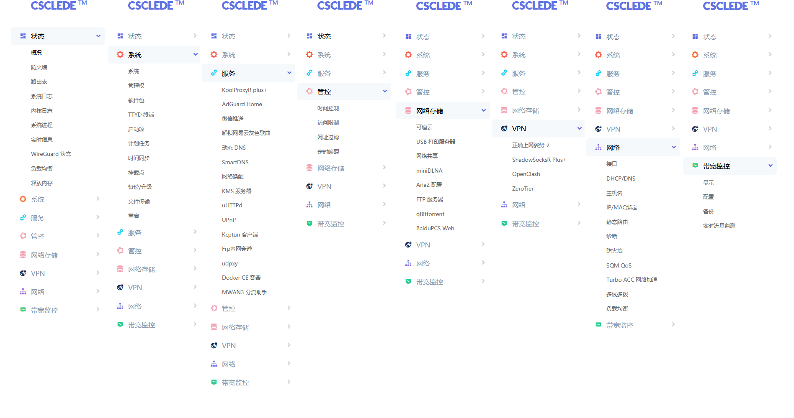

# AutoBuild-CSCLEDE

  

Build OpenWRT firware using Github actions for X86\Newifi\K3\GL-iNet elses.  

## Usage 

- IP: `192.168.1.1`  
- Username&Password: Please change your password for the first time login!  
- WiFiSSID: `CSCLEDE`  
- WiFiPassword: `coolsong`  

## Acknowledgments

- Source form [Lean's OpenWrt](https://github.com/coolsnowwolf/lede) & [Lienol's LEDE](https://github.com/Lienol/lean-lede)  
- Build Tools [P3TERX](https://github.com/P3TERX/Actions-OpenWrt) & [eSirplayground](https://github.com/esirplayground/AutoBuild-OpenWrt) & [YAMLCheckout](http://www.yamllint.com/)   
- Packages Related  
[luci-app-ssr-plus-Jo](https://github.com/Leo-Jo-My/luci-app-ssr-plus-Jo)  
[luci-app-openclash](https://github.com/vernesong/OpenClash)  
[luci-app-koolproxyR](https://github.com/tzxiaozhen88/luci-app-koolproxyR)  
[luci-app-adguardhome](https://github.com/rufengsuixing/luci-app-adguardhome)  
[openwrt-adguardhome](https://github.com/happyzhang1995/openwrt-adguardhome)  
[luci-app-serverchan](https://github.com/tty228/luci-app-serverchan)  
- Themes Related  
[luci-theme-argon](https://github.com/jerrykuku/luci-theme-argon)   

## License

[MIT](https://github.com/wubin2/AutoBuild-CSCLEDE/edit/master/LICENSE) © Tristan
